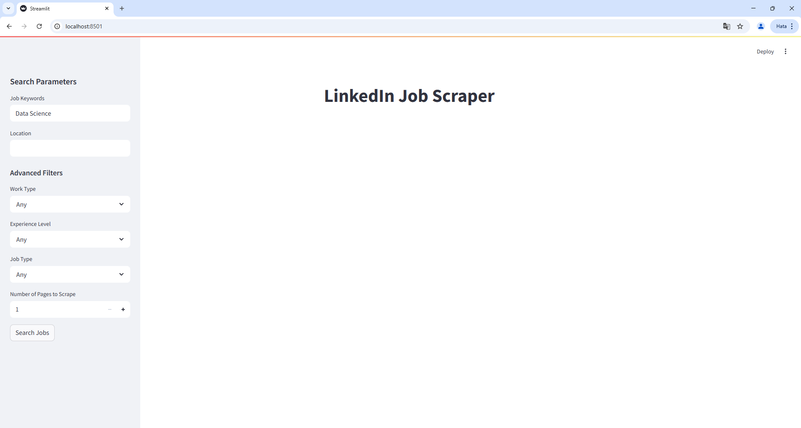
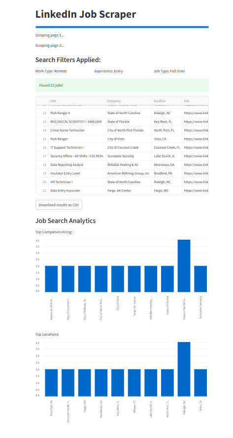
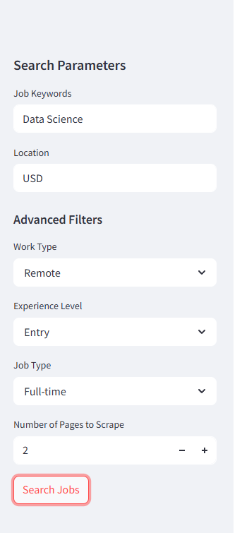

# LinkedIn Job Scraper

A web application built with Streamlit that scrapes job listings from LinkedIn with customizable filters and analytics.

###This project was created for educational and demonstration purposes only. It is intended to showcase web scraping, data handling, and interactive app ###development using Streamlit. Please respect the terms of service of any websites you interact with, and do not use this tool for commercial scraping or ###automation without permission.

## 🖼️ App Preview

Here are some screenshots of the app in action:

### 🔍 Job Search Interface


### 📊 Results And Analytics Dashboard


### 📝 Filter Sidebar



## Features

- Search jobs by keywords and location
- Advanced filtering options:
  - Work Type (Remote, On-site, Hybrid)
  - Experience Level (Internship to Executive)
  - Job Type (Full-time, Part-time, Contract, etc.)
- Real-time job search analytics
- Export results to CSV
- Progress tracking during scraping
- Visual analytics for top companies and locations

## Installation

Dont forget add Header for scraper.

1. Clone the repository:
```bash
git clone https://github.com/batuhantug/linkedin-job-scraper.git
cd linkedin-job-scraper
```

2. Create and activate virtual environment:
```bash
# Windows
python -m venv venv
.\venv\Scripts\activate

# Linux/Mac
python -m venv venv
source venv/bin/activate
```

3. Install dependencies:
```bash
pip install -r requirements.txt
```

## Usage

1. Start the Streamlit app:
```bash
streamlit run app.py
```

2. Enter your search criteria:
   - Job Keywords (e.g., "Python Developer")
   - Location (optional)
   - Select filters from the sidebar
   - Choose number of pages to scrape

3. Click "Search Jobs" to start scraping

4. View results and download as CSV if desired


